# 🕊️ Tsuru Origami - Passo a Passo

### 1️⃣ Passo 1  
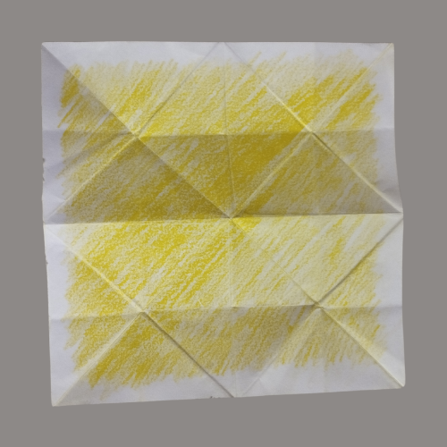

### 2️⃣ Passo 2  
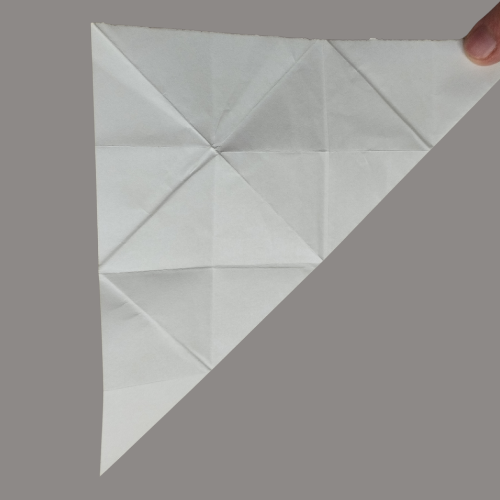

### 3️⃣ Passo 3  
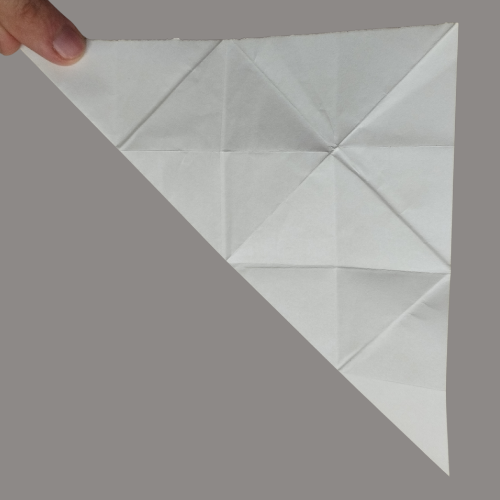

### 4️⃣ Passo 4  
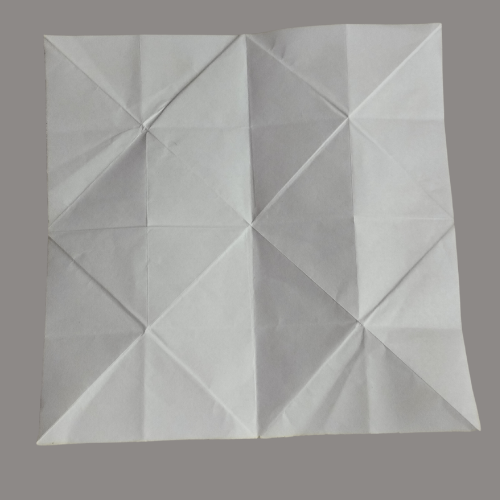

### 5️⃣ Passo 5  
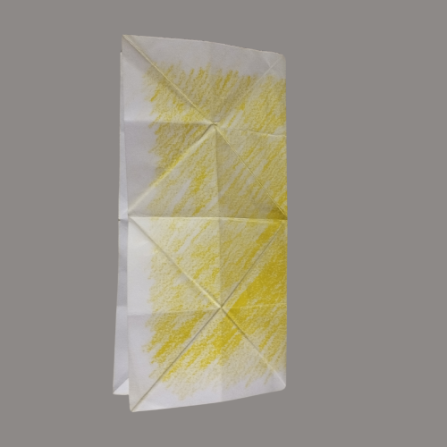

### 6️⃣ Passo 6  
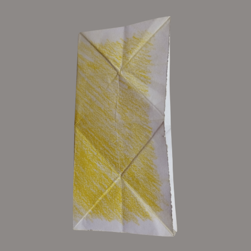

### 7️⃣ Passo 7  
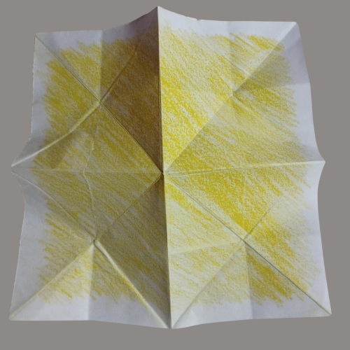

### 8️⃣ Passo 8  

### 9️⃣ Passo 9  
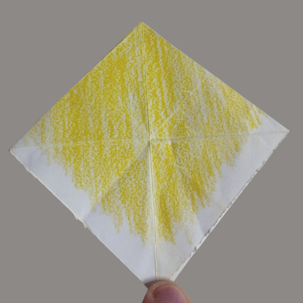

### 🔟 Passo 10  
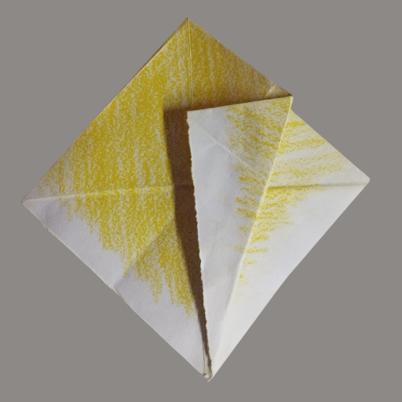

### 1️⃣1️⃣ Passo 11  
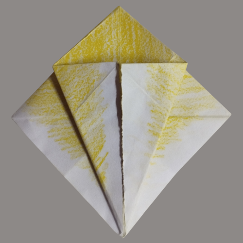

### 1️⃣2️⃣ Passo 12  
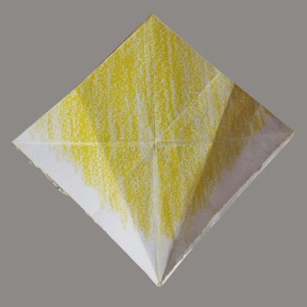

### 1️⃣3️⃣ Passo 13  
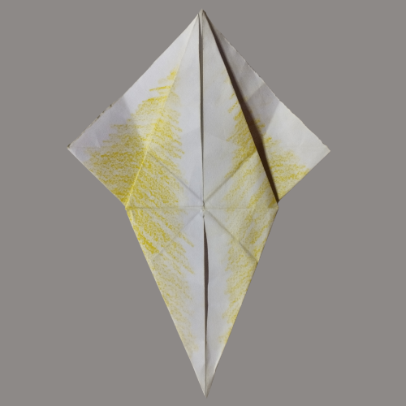

### 1️⃣4️⃣ Passo 14  
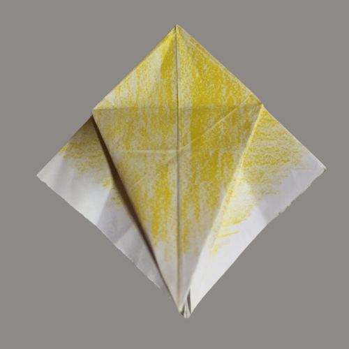

### 1️⃣5️⃣ Passo 15  
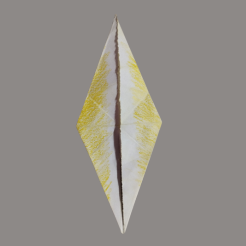

### 1️⃣6️⃣ Passo 16  
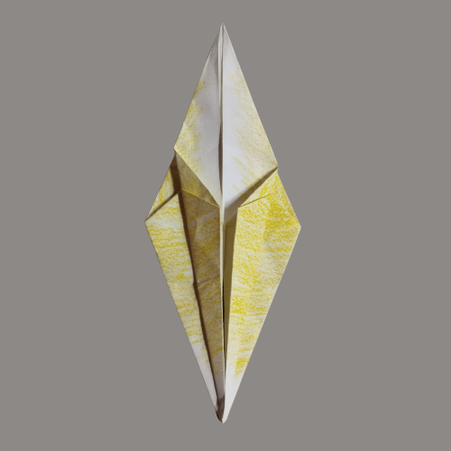

### 1️⃣7️⃣ Passo 17  
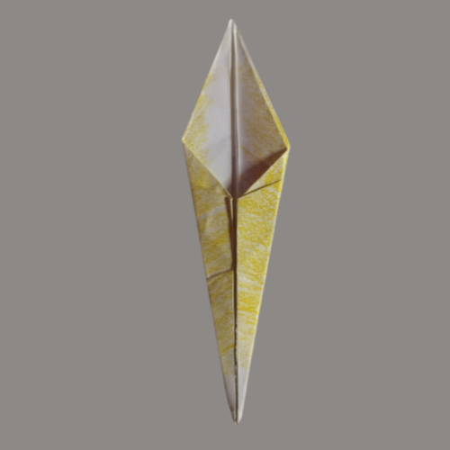

### 1️⃣8️⃣ Passo 18  
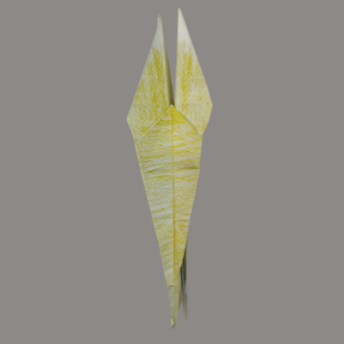

### 1️⃣9️⃣ Passo 19  
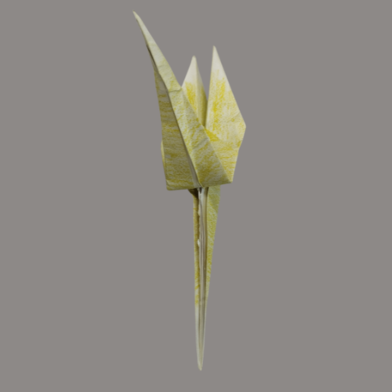

### 2️⃣0️⃣ Passo 20  
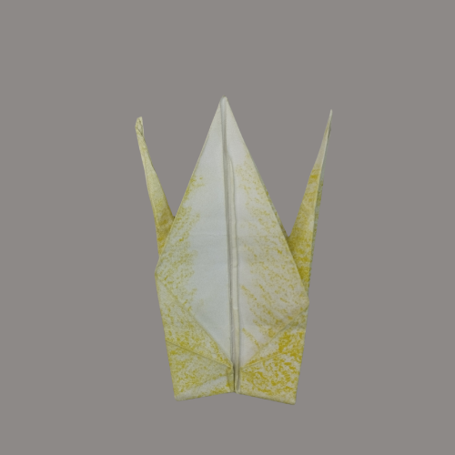

### 2️⃣1️⃣ Passo 21  
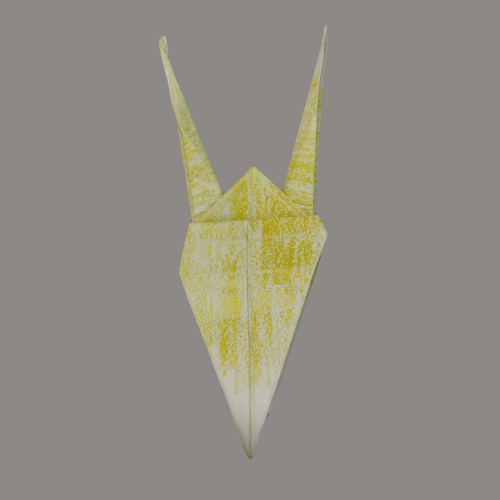

### 🏁 Passo 22 — Resultado Final  
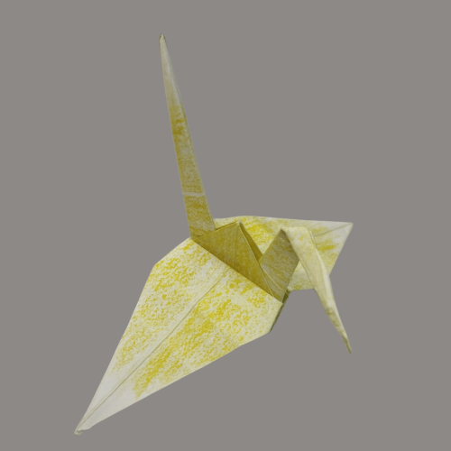

---
